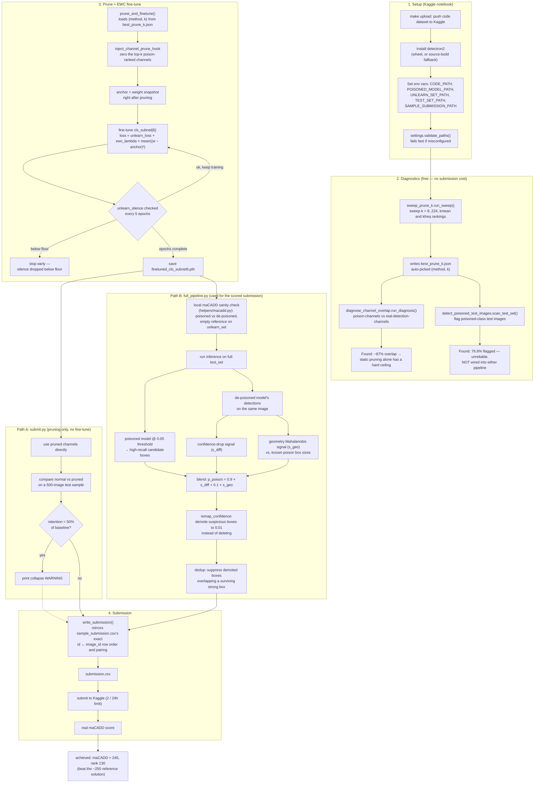

# Neural Debris Removal — Current Process

End-to-end pipeline as it stands after the first scored submission
(maCADD ≈ 245, rank 130). Two submission paths exist in the codebase —
`submit.py` (simpler, pruning only) and `full_pipeline.py` (prune + EWC
fine-tune + metric-aware post-processing, the one actually used for the
scored submission).

## Notes

- **Diagnostics are free** — they only read the 20 `unlearn_set` poison
  images plus sampled `test_set` images, never touch the submission quota.
- **The channel-overlap finding (~87%) is why prune-only has a ceiling** —
  poison detection and real detection share almost the same circuitry, so
  a static per-channel mask can't cleanly separate them (see `sweep_prune_k`'s
  own trade-off curve: no `k` gets both high silence and high retention).
- **EWC replaced an earlier distillation-based retain loss** that pulled
  the fine-tuned weights toward reproducing the *original* poisoned model's
  output — that collapsed unlearning almost entirely (silence 65%→5% in a
  real run). EWC instead anchors to the *already-pruned* state, so there's
  no term pulling behavior back toward the poison at all.
- **The poison-image scanner (`detect_poisoned_test_images.py`) is built
  but not trusted** — its 76.8%-flagged result is implausible and likely
  suffers from the same 87% channel-overlap limitation, since it's built
  from the same feature space.
- **The submission-format fix was necessary before anything could score** —
  `sample_submission.csv`'s `image_id` column is in lexicographic string
  order, not numeric; assigning `id` by numeric sort silently paired most
  rows with the wrong `image_id`, causing outright rejection.
